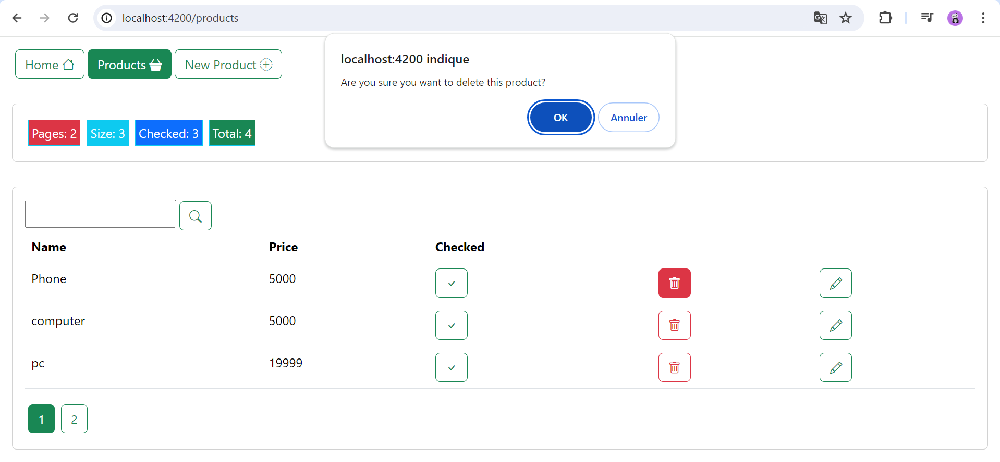
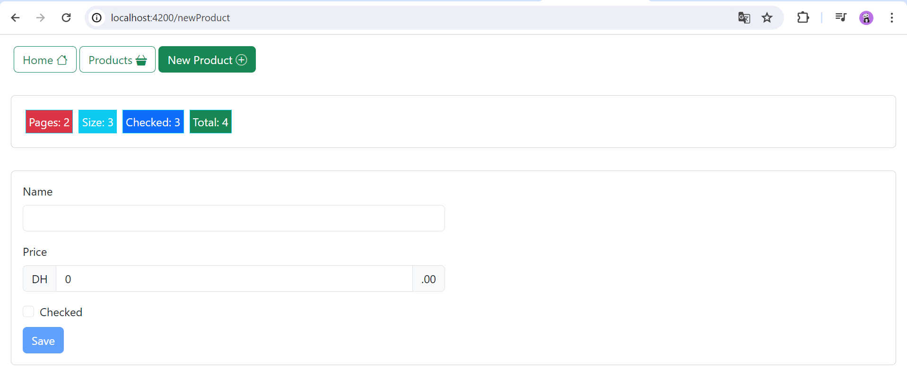

## Description 
Ce projet est une application de gestion de produits qui permet d'ajouter, de modifier, de supprimer et de consulter les produits. Il est développé en utilisant Angular Framework pour le frontend et Json-Server pour le backend.
### Technologies Used

- Angular Framework
- Json-Server
- Json-Server Auth
- Bootstrap
- Bootstrap Icons
  ## Installation
1. To clone the project, use the following command:

```bash
git clone https://github.com/dohabanoui/product-management-Angular
```
2. To install the dependencies, navigate to the project directory and run the following command:
```bash
npm install
```
3. To start the backend server, run the command

```bash
json-server -w data/db.json -p 8089  
```
4. To start the frontend serve
 ```bash
   ng serve
```
5.Open your web browser and navigate to the following address:
 ```bash
   http://localhost:4200/
```


## Result 

The home interface where further development can take place.

For the products section, we have a list of products where the user can search, delete, or modify products. Additionally, they can also modify checked items.

For the search function, the user can search for specific products within the list.

For the delete function, users simply need to click on the delete button to remove the selected item.

To add a new product, users need to specify the name, price, and also check the box for the "checked" function.

To modify a product, users should click on the "Edit" button corresponding to the product they want to modify. They can then make the desired changes to the product, followed by clicking on the "Save" button to confirm the modifications.


